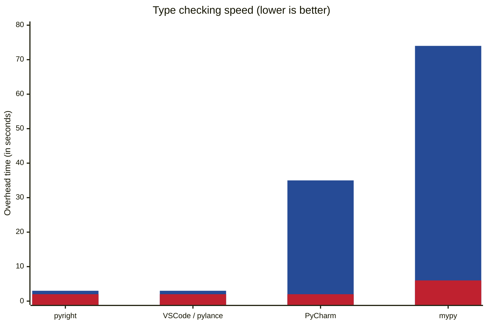

# Comparison of type checkers

| Color | Start type |
|-|-|
| $${\color{blue}⬤}$$ | Cold start (initial run after installation) |
| $${\color{red}⬤}$$ | Warm start with cache (consequent runs) |

```mermaid
---
config:
    xyChart:
        width: 900
        height: 600
    themeVariables:
        xyChart:
            plotColorPalette: "#264b96,#bf212f"
---
xychart-beta
    title "Type checking speed (lower is better)"
    x-axis [pyright, "VSCode / pylance", PyCharm, mypy]
    y-axis "Overhead time (in seconds)" 0 --> 80
    bar [3, 3, 35, 74]
    bar [2, 2, 2, 6]
```
